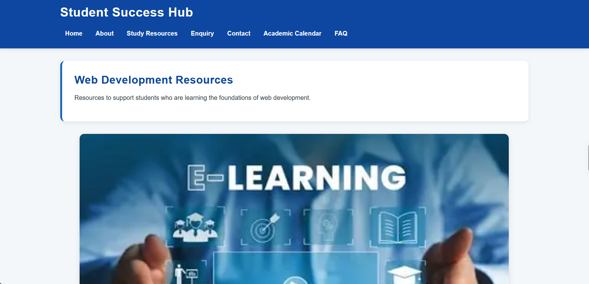
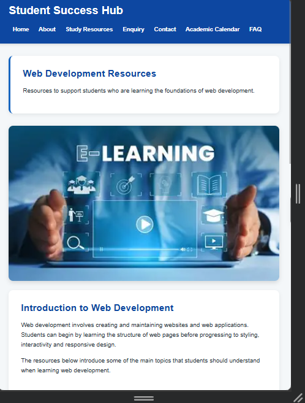
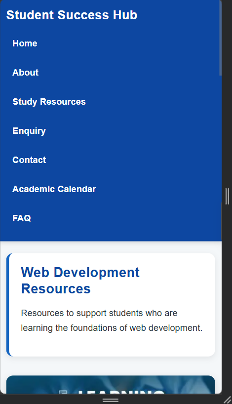

# Student Success Hub

## WEDE5020 - Web Development (Introduction)

Student Success Hub is a student-focused website designed to provide useful academic and learning resources in one place. The website provides students with access to study resources, academic information, business topics, programming topics, contact information and frequently asked questions.

The website was developed using HTML and CSS, with a focus on clear structure, simple navigation, accessibility and responsive design.

---

# Website Purpose

The purpose of Student Success Hub is to provide students with an easy-to-use website where they can find useful academic information and learning resources.

The website aims to:

- Provide students with useful study resources.
- Help students find important academic information.
- Provide information about business and programming topics.
- Allow students to submit enquiries.
- Provide contact information.
- Answer common student questions.
- Present information in a clear and organised way.
- Make the website usable on desktop, tablet and mobile devices.

---

# Website Pages

The website contains the following pages:

| Page | Description |
|---|---|
| Home | Introduces Student Success Hub and provides an overview of the available resources. |
| About | Provides information about the website, including its mission and vision. |
| Study Resources | Provides learning information about HTML, CSS, JavaScript, responsive design and accessibility. |
| Business Resources | Provides information about business-related topics such as management and business processes. |
| Programming Resources | Provides information about programming topics such as variables, loops, arrays and methods. |
| Enquiry | Allows students to submit an enquiry. |
| Contact | Provides contact information and a contact form. |
| Academic Calendar | Provides information about important academic activities and dates. |
| FAQ | Provides answers to frequently asked questions. |


# Responsive Design Testing

The website was tested at desktop, tablet, and mobile screen sizes using Microsoft Edge Developer Tools.

### Desktop View


### Tablet View


### Mobile View



---

# Technologies Used


The following technologies were used to develop the website:

- HTML5
- CSS3
- GitHub
- GitHub Desktop
- Visual Studio Code
- Browser Developer Tools

HTML5 was used to create the structure and content of the website.

CSS3 was used to style the website and create the responsive layouts.

GitHub was used for version control and to store the project repository.

Browser Developer Tools were used to test the website at different screen sizes.

---

# File and Folder Structure

The project uses the following structure:

```text
Student Success Hub/
│
├── index.html
├── style.css
├── README.md
│
├── Pages/
│   ├── about.html
│   ├── study-resources.html
│   ├── business.html
│   ├── programming.html
│   ├── enquiry.html
│   ├── contact.html
│   ├── academic-calendar.html
│   └── faq.html
│
└── images/
    ├── students.jpg
    ├── Studying.jpg
    ├── learning.jpg
    ├── material.jpg
    └── Digital.jpg
Part 1 Feedback Implemented
The Part 1 website received feedback relating mainly to the use of HTML elements, the amount of website content, README documentation and references.
The following changes were made in Part 2.
1. More HTML Elements
Additional HTML elements were used to improve the structure and presentation of the website.
These include:
<header>
<nav>
<main>
<section>
<article>
<footer>
<table>
<caption>
<form>
<label>
<input>
<textarea>
<select>
<button>
Ordered lists
Unordered lists
Images with alternative text
Semantic elements such as <section> and <article> were used to make the website structure clearer.
2. More Website Content
Additional content was added to address the feedback requesting more content.
The website now includes:
Hero and supporting images.
Additional information sections.
Study tips.
Business resources.
Programming resources.
An academic calendar table.
Additional FAQ information.
Mission and vision information.
More detailed resource descriptions.
Improved enquiry and contact forms.
3. Improved Academic Calendar
The Academic Calendar page was expanded to include a table containing academic activities and information about what students should do.
The table is placed inside a responsive container so that it can still be viewed on smaller screens.
4. Improved README Documentation
The README was expanded to provide information about:
The purpose of the website.
Website pages.
Technologies used.
File and folder structure.
Part 1 feedback.
Part 2 development.
Responsive design.
Testing.
Changelog.
References.
Part 2 - CSS Styling
An external stylesheet named style.css was created and linked to all website pages.
The stylesheet provides a consistent design across the website.
CSS Reset
A CSS reset was implemented to remove default browser margins and padding.
The box-sizing property was also used to make sizing easier to manage.
Base Styling
The base styling defines:
Font family.
Font size.
Line height.
Text colour.
Background colour.
Margins.
Padding.
The website mainly uses relative units such as rem, % and vw.
Typography
Typography was styled using CSS properties including:
font-family
font-size
font-weight
line-height
letter-spacing
Different heading sizes were used for <h1>, <h2> and <h3> elements.
The typography is also adjusted at smaller screen sizes using media queries.
Layout
CSS Grid and Flexbox were used to create the website layouts.
The feature cards use CSS Grid to create multiple columns on larger screens.
Flexbox is used for the navigation menu.
The layouts change at smaller screen sizes so that content can be displayed in fewer columns.
Colours and Decoration
CSS was used to create a consistent colour scheme throughout the website.
The styling includes:
Background colours.
Text colours.
Borders.
Rounded corners.
Box shadows.
Button styling.
Navigation styling.
Card styling.
The design uses a blue-based colour scheme to create a clean academic and technology-focused appearance.
Pseudo-Classes
CSS pseudo-classes were used to improve interaction and accessibility.
The website includes:
:hover
:focus
:active
These are used on navigation links, buttons, cards and form controls.
The :focus styling provides a visible outline when interactive elements receive keyboard focus.
Responsive Design
The website was designed to work across different screen sizes.
Three main layout levels were considered:
Desktop
Tablet
Mobile
Media queries were used to change the layout depending on the screen width.
Desktop
On larger screens:
Feature cards are displayed in multiple columns.
Navigation links are displayed horizontally.
Content has wider spacing.
Larger typography is used.
Tablet
At widths of 900px and below:
Feature cards change to two columns.
Navigation spacing is reduced.
Heading sizes are reduced.
Hero section spacing is adjusted.
Mobile
At widths of 600px and below:
Feature cards change to one column.
Navigation links are displayed vertically.
Typography is reduced.
Content padding is reduced.
Tables can scroll horizontally.
Images scale to fit the available screen width.
A further breakpoint at 400px is used for very small mobile screens.
Responsive Images
Images are styled using responsive CSS so that they scale according to the available screen width.
The HTML also uses srcset and sizes attributes where appropriate.
Example:
HTML

Alternative text is provided for images to improve accessibility.
Forms
The Enquiry and Contact pages contain forms.
Form elements were styled using CSS to provide:
Consistent spacing.
Borders.
Padding.
Rounded corners.
Focus indicators.
Consistent font styling.
Styled buttons.
Labels were included with form controls to improve usability.
Accessibility
Accessibility was considered during development.
The website includes:
Semantic HTML elements.
Alternative text for images.
Labels for form controls.
Keyboard focus indicators.
Clear headings.
Readable text.
Consistent navigation.
Responsive layouts.
The aim is to make the website easier for different users to navigate and understand.
Testing
The website was tested using browser Developer Tools.
Testing included checking the website at different viewport sizes.
The following testing sizes were used when recording the final evidence:
Device Type
Example Width
Purpose
Desktop
1440px
Check the full desktop layout.
Tablet
768px
Check the tablet layout and two-column content.
Mobile
375px
Check the mobile layout and vertical navigation.
Small Mobile
320px
Check the layout on a smaller mobile screen.
The following areas were checked:
Navigation links.
Page layouts.
Images.
Forms.
Buttons.
Tables.
Text readability.
Responsive card layouts.
Mobile navigation.
Horizontal scrolling of tables.
Different screen sizes.
Screenshots of the responsive testing are included above as evidence for Part 2.
GitHub Development
GitHub was used to store the project and track development.
Descriptive commits should be used to show the development process.
Examples of descriptive commits include:
Added external CSS stylesheet
Updated website content based on Part 1 feedback
Added academic calendar table
Added business and programming resources
Added responsive CSS media queries
Improved form styling and accessibility
Updated README documentation and references
The final GitHub repository should contain the updated HTML files, CSS stylesheet, images and README.
Changelog
Part 1 Corrections
Added more website content
Additional content was added to several pages to address the Part 1 feedback requesting more content.
Changes included:
Added additional supporting images.
Added more descriptive paragraphs.
Added study tips.
Added business resources.
Added programming resources.
Added additional FAQ content.
Improved use of HTML elements
Additional HTML elements were introduced to make better use of HTML5.
Changes included:
Added <article> elements for resource cards.
Added a table and caption to the Academic Calendar page.
Improved form structure using labels and form controls.
Added semantic sections throughout the website.
Improved image usage
More images were incorporated into the website to address the Part 1 feedback requesting additional visual content.
Images were also given descriptive alternative text.
Fixed image path
The image path on the Enquiry page was corrected so that the image correctly references the image folder from inside the Pages folder.
Part 2 Changelog
Version 2.0 - CSS Styling
Created the external style.css stylesheet.
Linked the stylesheet to all website pages.
Added a CSS reset.
Added base typography styling.
Added a consistent colour scheme.
Added Flexbox navigation.
Added CSS Grid layouts.
Added card styling.
Added button styling.
Added form styling.
Added table styling.
Added hover effects.
Added focus effects.
Added active states.
Version 2.1 - Responsive Design
Added tablet media queries.
Added mobile media queries.
Changed feature cards from three columns to two columns on tablets.
Changed feature cards to one column on mobile devices.
Changed navigation to a vertical layout on mobile.
Adjusted heading sizes for smaller screens.
Adjusted spacing and padding for smaller screens.
Added responsive table behaviour.
Added responsive image styling.
Version 2.2 - Content Improvements
Added Business Resources.
Added Programming Resources.
Expanded Web Development Resources.
Added additional study tips.
Added an academic calendar table.
Expanded About page content.
Improved Contact page content.
Improved Enquiry page form.
Added additional FAQ content.
Version 2.3 - Documentation
Updated the README.
Added Part 1 feedback corrections.
Added Part 2 development information.
Added a detailed changelog.
Added references.
Added testing information.
References
The following resources were used to support the development and understanding of HTML, CSS, responsive design and accessibility.
Mozilla Developer Network (MDN) Web Docs. (n.d.). HTML: HyperText Markup Language. Available at: https://developer.mozilla.org/en-US/docs/Web/HTML⁠�
Mozilla Developer Network (MDN) Web Docs. (n.d.). CSS: Cascading Style Sheets. Available at: https://developer.mozilla.org/en-US/docs/Web/CSS⁠�
Mozilla Developer Network (MDN) Web Docs. (n.d.). Using media queries. Available at: https://developer.mozilla.org/en-US/docs/Web/CSS/CSS_media_queries/Using_media_queries⁠�
World Wide Web Consortium (W3C). (n.d.). Web Accessibility Initiative (WAI). Available at: https://www.w3.org/WAI/⁠�
World Wide Web Consortium (W3C). (n.d.). Web Content Accessibility Guidelines (WCAG). Available at: https://www.w3.org/WAI/standards-guidelines/wcag/⁠�
GitHub Repository
GitHub Repository:
https://github.com/Kwanda11/My-Website
Conclusion
Student Success Hub was developed to provide students with a simple and organised platform for accessing academic and learning information.
Part 2 focused on improving the website based on Part 1 feedback, implementing an external CSS stylesheet, improving the visual design, adding responsive layouts and documenting the development process.
The website is designed to provide a consistent experience across desktop, tablet and mobile screen sizes.


